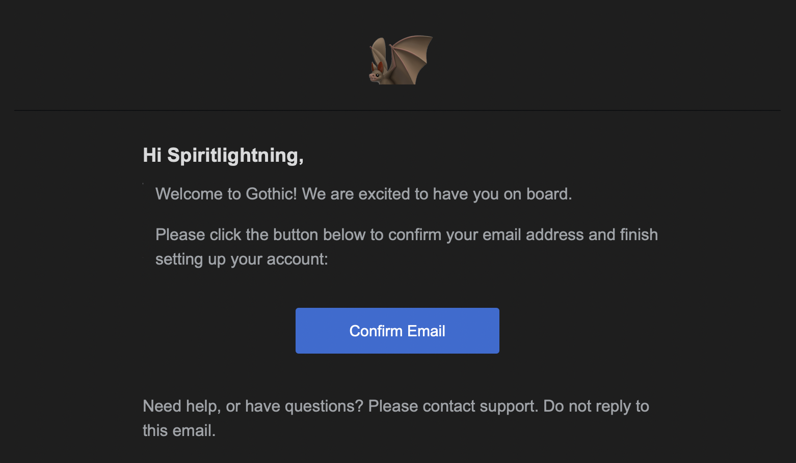
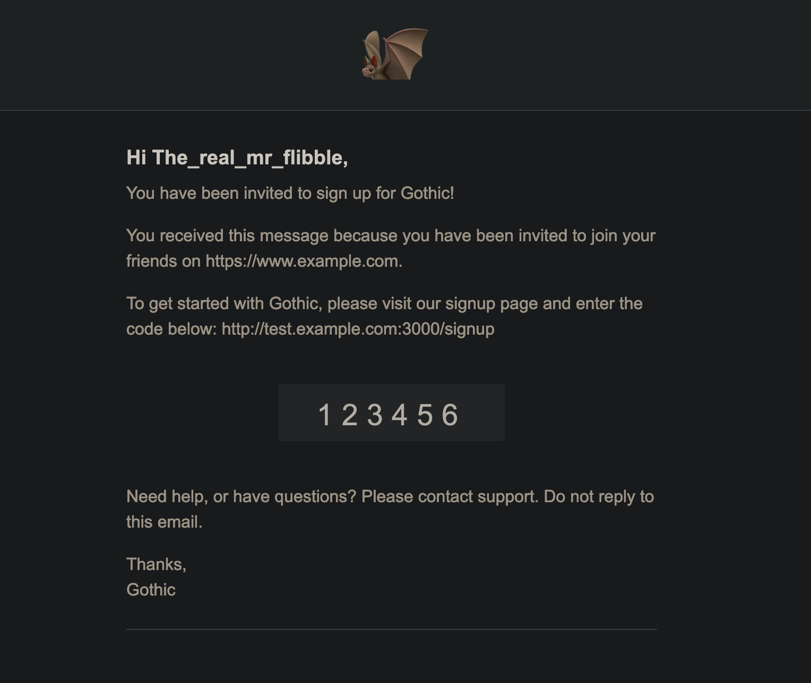

# 🦇 &nbsp;Gothic


[](https://goreportcard.com/report/github.com/jrapoport/gothic)
[](https://codecov.io/gh/jrapoport/gothic)

[](https://github.com/jrapoport/gothic/blob/master/LICENSE)

[](https://www.buymeacoffee.com/jrapoport)

Gothic is a user registration and authentication microservice written in Go. It's based on OAuth2 and JWT and will
handle user signup, authentication and custom user data.

## WHY?

`Gothic` is a free production-ready authentication server.

It is a complete rewrite of [Netlify's GoTrue](https://github.com/netlify/gotrue) and is ~85-90% complete.

`GoTrue` only supports `REST` + `mysql`, and is outdated. `Auth0` is prohibitively expensive for small startups, 
garage projects, & consumer applications.

`Gothic` is designed to get you up and running quickly without having to spend months coding the exact same thing for the 
umpteenth time —  without sacrificing functionality, or a professional look & feel.

**UPDATE**  
* Docker containers now build and compose correctly on Apple Silicon (arm64).


* REST API is now complete w.r.t. GoTrue's functionality (except for SAML — which was intentionally left out).
  

* gRPC API is now (95%) complete w.r.t. GoTrue's functionality.

## WIP

This project is currently in progress. Things *will* change. Sometimes big things. Don't @ me.

## Getting Started

### Installing

To start using Gothic, install Go (version 1.15+) and run `go get`:

```sh
$ go get -u github.com/jrapoport/gothic
```

### Building

Gothic supports GO Modules. To build Gothic simply type `make` or `make build` after cloning this repo to build a
`DEBUG` version of Gothic for development. This will build `gothic` & its command line tool, `gadmin`, under the `build`
directory.

```sh
$ make
# or 
$ make build
```

To build a `RELEASE` (a.k.a. production) version of Gothic use `make release`

```sh
$ make release
```

### Running

Gothic supports configuration through environment vars, `.env` files, `.json` files or `.yaml` and only requires a
handful of configuration options to get started.

For a full list of configuration options please see the [Configuration](#configuration) section below.

### Using Gadmin

Gadmin is the Gothic control plane.

#### Building Gadmin 

```sh
$ make
# or 
$ make build
```

To build a `RELEASE` (a.k.a. production) version of Gadmin use `make release`

GAdmin requires the address of your Gothic rpc admin server & your root password. The address and password can be 
supplied in a [configuration file](#configuration) by setting a path to the file with `-c` (or `--config`) command line 
switch. Alternatively you can set the server address with the `-s` (`--server`) switch and the root password using the 
`--root` switch.

#### Generating a signup code with Gadmin

First make sure that Gothic is up and running and that its admin server is accessible.

```sh
$ ./build/release/gadmin -s [ADMIN_SERVER_ADDRESS] --root [ROOT_PASSWORD] code
> created 1 codes
> 123456
```

### Using gRPC-Web

First start your instance of `gothic`, or use the container:

```sh
$ make db
$ make gothic
```

Next, you will need to start the `envoy` server

```sh
$ make envoy
```

Once `gothic`, the db, & `envoy` are running you can make gRPC-Web calls using
the [javascript bindings](https://github.com/jrapoport/gothic/blob/master/api/grpc/web).

to regenerate the protobuf typescript bindings:

```sh
$ make rpcw
# or
$ make grpc
```

#### Startup

By default, Gothic will search a config file named `gothic.env`, `gothic.json`, or `gothic.yaml` in the following
directory locations:

```sh
$ .
$ ~/.gothic
$ /etc/gothic
```

Alternatively, you can use the `--config` or `-c` command line flag to specify a path to a config file to use.

#### Required Settings

```properties
GOTHIC_SITE_URL=http://example.com
GOTHIC_ROOT_PASSWORD=my-super-admin-password
GOTHIC_JWT_SECRET=i-am-a-secret
GOTHIC_DB_DRIVER=mysql
GOTHIC_DB_DSN=root@tcp(localhost:3306)/my_gothic_db
```

`GOTHIC_SITE_URL` - `string` **required**

This is base URL for your site. The base url is used to construct things like referral URLs in email.

`GOTHIC_ROOT_PASSWORD` - `string` **required**

The password for the built-in super admin account. Certain operations are currently restricted to the super admin user.

Interactive logins are **not** supported for super admins and super admin functionality must be accessed via `gadmin`.
*This may change in the future with additional API support for the root password a/o a specialized bearer token.*

`GOTHIC_JWT_SECRET` - `string` **required**

The shared secret for JWT tokens. Webhooks can optionally override this with a custom value for callbacks.

```properties
GOTHIC_DB_DRIVER=mysql
GOTHIC_DB_DSN=root@tcp(0.0.0.0:3306)/my_gothic_db
```

`GOTHIC_DB_DRIVER` - `string` **required**

The dialect of the database you to use. Currently, `mysql`, `postgres`, `sqlserver`, and `sqlite` (or `sqlite3`) are all
supported. Other values will be treated as a generic sql connection and passed to the `mysql` driver.  
Defaults to `mysql`.

In the future, direct support for other databases via `gorm.io` drivers may be added.

`GOTHIC_DB_DSN` - `string` **required**

Connection string for the database.

## Supported Technologies

### gRPC & gRPC-Web APIs

Gothic supports a full range of gRPC & gRPC-Web APIs. gRPC-Web APIs are external and designed to be publicly available.
By contrast, gRPC APIs are reserved for admin operations a/o microservice communication. The gRPC host address should
**not** be publicly accessible.

**API are currently a WIP**. For now, they should not be considered stable and subject to change at any time.

### REST APIs

Gothic supports a full range of REST APIs for users & administrative access.

**API are currently a WIP**. For now, they should not be considered stable and subject to change at any time.

### Databases

Gothic uses [gorm](https://gorm.io/) for database support.

### OAuth External Providers

Gothic uses [goth](https://github.com/markbates/goth) for external oauth providers now. Now we support everything
that [goth](https://github.com/markbates/goth) supports.

### Email Formatting

Gothic uses [hermes](https://github.com/matcornic/hermes/) for email templates.

### SMTP

Gothic uses [go-simple-mail](https://github.com/xhit/go-simple-mail/) for smtp server support.

### JWT Tokens

Gothic uses [lestrrat-go](https://github.com/lestrrat-go/jwx) for jwt tokens.

### Config Files

Gothic uses [viper](https://github.com/spf13/viper) for configuration file support.

### CLI

Gothic uses [cobra](https://github.com/spf13/cobra) for command line tool support.

## Configuration

Gothic supports config files in `.env`, `.yaml` and `.json` formats in addition to env vars.

Please see the [example.env](https://github.com/jrapoport/gothic/blob/master/example.env) or
[test configurations](https://github.com/jrapoport/gothic/blob/master/config/testdata) for complete examples.

### Service

```properties
GOTHIC_SERVICE="gothic"
GOTHIC_SITE_URL=http://example.com
```

`GOTHIC_SERVICE` - `string`

The name of the authentication service. This is used in a variety of places and settings. A normalized version of this
value is also used as the name of the internal (email) signup provider (enabled by default). Defaults to `gothic`.

`GOTHIC_SITE_URL` - `string` **required**

This is base URL for your site. The base url is used to construct things like referral URLs in email.

### Networking

```properties
GOTHIC_HOST=localhost
GOTHIC_HEALTH_ADDRESS=localhost:7720
GOTHIC_RPC_ADDRESS=localhost:7721
GOTHIC_ADMIN_ADDRESS=localhost:7722
GOTHIC_REST_ADDRESS=localhost:7727
GOTHIC_RPCWEB_ADDRESS=localhost:7729
GOTHIC_REQUEST_ID=gothic-req
```

`GOTHIC_HOST` - `string`

Hostname to listen on. Defaults to `localhost`.

`GOTHIC_HEALTH_ADDRESS` - `string`

The health check host address to listen on. The health check host currently uses `HTTP` and responds to any `GET`
request with a `json` response. Defaults to `[GOTHIC_HOST]:7720`.

`GOTHIC_RPC_ADDRESS` - `string`

The gRPC host address to listen on. gRPC APIs are for admin operations a/o microservice communication. Defaults to
`[GOTHIC_HOST]:7721`.

The gRPC API should be considered internal and **not** publicly available. This address should **not** be internet
accessible.

`GOTHIC_ADMIN_ADDRESS` - `string`

The gRPC admin host address to listen on. Operations on this address are secured by a valid JWT token with admin 
permissions. Defaults to `[GOTHIC_HOST]:7722`.

`GOTHIC_REST_ADDRESS` - `string`

The REST host address to listen on. REST APIs are for users & administrative access. Defaults to `[GOTHIC_HOST]:7727`.

The REST API should be considered external and publicly available. This address should be internet accessible.

`GOTHIC_RPCWEB_ADDRESS` - `string`

The gRPC-Web host address to listen on. gRPC-Web APIs are for users & (potentially some) administrative access. Defaults
to `[GOTHIC_HOST]:7729`.

The gRPC-Web API should be considered external and publicly available. This address *could* be internet accessible for
direct gGPC HTTP/2 communication. However, typically this address would **not** be internet accessible. Instead, it
would be accessible to an [Envoy](https://www.envoyproxy.io/) proxy server, which would itself expose an internet
accessible address. Please see [envoy.yaml](https://github.com/jrapoport/gothic/blob/master/envoy.yaml) &
[docker-compose.yaml](https://github.com/jrapoport/gothic/blob/master/docker-compose.yaml) for a working example.

For more details on the `envoy` proxy, please see [https://www.envoyproxy.io/](https://www.envoyproxy.io/).

`GOTHIC_REQUEST_ID` - `string` **in progress**

The prefix of the request id to use. Support for request ids / a request id prefix is in progress.

### Security

```properties
# general
GOTHIC_ROOT_PASSWORD=my-super-admin-password
GOTHIC_MASK_EMAILS=true
GOTHIC_RATE_LIMIT=5m0s
# jwt
GOTHIC_JWT_SECRET=i-am-a-secret
GOTHIC_JWT_ALGORITHM=HS256
GOTHIC_JWT_ISSUER=gothic
GOTHIC_JWT_AUDIENCE=gothic-server-01
GOTHIC_JWT_EXPIRATION=60m0s
# recaptcha
GOTHIC_RECAPTCHA_KEY=SECRET-RECAPTCHA-KEY
GOTHIC_RECAPTCHA_LOGIN=true
# validation
GOTHIC_VALIDATION_USERNAME_REGEX="^[a-zA-Z0-9_]{2,255}$"
GOTHIC_VALIDATION_PASSWORD_REGEX="^[a-zA-Z0-9[:punct:]]{8,40}$"
# cookies
GOTHIC_COOKIES_DURATION=24h0m0s
```

#### General

`GOTHIC_ROOT_PASSWORD` - `string` **required**

The password for the built-in super admin account. Certain operations are currently restricted to the super admin user.

`GOTHIC_MASK_EMAILS` - `boolean ("true" or "false")`

If `true` Gothic will automatically mask the users email when returning user information by default. Please note that
admin requests for user info will **always** return **unmasked** emails. Defaults to `true`.

`GOTHIC_RATE_LIMIT` - `duration (e.g. 0m60s)`

The rate limit per 100 requests within the defined window to be enforced by IP address. Defaults to `5m0s`.

#### JWT

`GOTHIC_JWT_SECRET` - `string` **required**

The shared secret for JWT tokens. Webhooks can optionally override this with a custom value for callbacks.

`GOTHIC_JWT_ALGORITHM` - `string`

The algorithm to use when signing JWT tokens `"alg"`. Defaults to `HS256`.

`GOTHIC_JWT_ISSUER` - `string`

The issuer to include with JWT tokens `"iss"`. Defaults to `GOTHIC_SERVICE`, which defaults to `gothic`.

`GOTHIC_JWT_AUDIENCE` - `comma seperated string array`

The audience to optionally include with JWT tokens `"aud"`. Value is comma separated list of resources that should
accept the token.

`GOTHIC_JWT_EXPIRATION` - `duration (e.g. 60m0s)`

The expiration time for JWT tokens `"exp"`. Defaults to 1 hour `60m0s`.

#### ReCaptcha

`GOTHIC_RECAPTCHA_KEY` - `string`

Your ReCaptcha secret key. If set, gothic will expect recaptcha token with signup a/o login requests and perform a
ReCaptcha check with the supplied token and client IP. You can obtain a Recaptcha site key from Google
[here](https://www.google.com/recaptcha/).

*NOTE: The RemoteIP from REST or gRPC requests will be automatically be used as client IP*

##### Testing & Development

`DEBUG` builds of gothic can perform mock ReCaptcha checks. To mock a ReCaptcha check set `GOTHIC_RECAPTCHA_KEY` to
`RECAPTCHA-DEBUG-KEY` and use `"RECAPTCHA-DEBUG-TOKEN"` as the ReCaptcha token when making signup or login requests.

```properties
GOTHIC_RECAPTCHA_KEY="RECAPTCHA-DEBUG-KEY"
```

When `"RECAPTCHA-DEBUG-KEY"` is used, `"RECAPTCHA-DEBUG-TOKEN"` will always succeed. Using any other value as the
ReCaptcha token will cause the check to fail.

#### Validation

`GOTHIC_VALIDATION_USERNAME_REGEX` - `string`

The regex to use when validating usernames. If set, usernames will be checked on signup or update to make sure they
pass. Setting this to `""` will disable the username validation. Defaults to `^[a-zA-Z0-9_]{2,255}$`
(lower and uppercase alpha-numeric characters + underscore `_`; minimum length: 2; maximum length: 255).

`GOTHIC_VALIDATION_PASSWORD_REGEX` - `string`

The regex to use when validating passwords. If set, passwords will be checked on signup or update to make sure they
pass. Setting this to `""` will disable the password validation. Defaults to `^[a-zA-Z0-9[:punct:]]{8,40}$`
(lower and uppercase alpha-numeric characters + underscore `_`; minimum length: 2; maximum length: 255).

This setting only applies to users that signup using the internal Gothic provider (email). It has no effect on signups
or authentication with external providers.

#### Cookies

`GOTHIC_COOKIES_DURATION` -  `duration (e.g. 60m0s)` **REST ONLY**

If set, the cookie expiration time to use. Setting this to `0` will disable cookies. Defaults to `24h0m0s` (24 hours).

### Authorization

```properties
# internal
GOTHIC_PROVIDER_INTERNAL=true
GOTHIC_PROVIDER_REDIRECT_URL=http://example.com/redirect
# external providers
GOTHIC_PROVIDER_GOOGLE_CLIENT_KEY="SECRET-GOOGLE-OAUTH-KEY"
GOTHIC_PROVIDER_GOOGLE_SECRET="i-am-a-secret"
GOTHIC_PROVIDER_GOOGLE_CALLBACK_URL=http://example.com/callback
GOTHIC_PROVIDER_GOOGLE_SCOPES=login,confirmed
...
GOTHIC_PROVIDER_GITHUB_CLIENT_KEY="SECRET-GITHUB-OAUTH-KEY"
GOTHIC_PROVIDER_GITHUB_SECRET="i-am-a-secret"
GOTHIC_PROVIDER_GITHUB_CALLBACK_URL=http://example.com/callback
GOTHIC_PROVIDER_GITHUB_SCOPES=username,email
```

`GOTHIC_PROVIDER_INTERNAL` - `boolean ("true" or "false")`

If `true` Gothic will allow users to signup and login directly using their email address. If `false` only external
providers (if configured) will be supported for signup and or login. Defaults to `true`.

`GOTHIC_PROVIDER_REDIRECT_URL` - `string` **NOT IMPLEMENTED**

This was carried over from GoTrue. Need to implement this or drop it if no longer needed.

#### External Providers

Gothic supports a variety of OAuth external providers for signup and login. `SAML` is not supported.

[Click here](https://github.com/jrapoport/gothic/blob/master/models/types/provider/external.go) for a complete list of
the external providers Gothic supports.

`[NAME]` is the name of the
[external provider](https://github.com/jrapoport/gothic/blob/master/models/types/provider/external.go) you wish to
enable and should be replaced. e.g. to enable `github` support,
`GOTHIC_PROVIDER_[NAME]_CLIENT_KEY` would be `GOTHIC_PROVIDER_GITHUB_CLIENT_KEY`.

```properties
GOTHIC_PROVIDER_NAME_CLIENT_KEY="SECRET-GOOGLE-OAUTH-KEY"
GOTHIC_PROVIDER_NAME_SECRET="i-am-a-secret"
GOTHIC_PROVIDER_NAME_CALLBACK_URL=http://example.com/callback
GOTHIC_PROVIDER_NAME_SCOPES=login,confirmed
```

`GOTHIC_PROVIDER_[NAME]_CLIENT_KEY` - `string` **required to enable provider**

The client key to use when authenticating with an external provider. The OAuth2 client key or cliemt ID is provided by
the external provider when you register with them.

`GOTHIC_PROVIDER_[NAME]_SECRET` - `string`

The secret to use when authenticating with an external provider. The OAuth2 secret is provided by the external provider
when you register with them.

`GOTHIC_PROVIDER_[NAME]_CALLBACK_URL` - `string`

The callback URL to use when authenticating with an external provider. Typically, this URL is pre-registered with the
oauth provider and must match. The OAuth2 provider will redirect to this URL with the `code` and `state`
values required to complete the OAuth2 authentication. Defaults to `"http://:host/account/auth/callback"`. The `:host`
token defaults to, and will be automatically replaced by, the value of `GOTHIC_REST`.

`GOTHIC_PROVIDER_[NAME]_SCOPES` - `comma seperated string array` *optional*

A string array of additional scopes to include. By default, Gothic will include the scope(s) necessary for the user's
email for a given provider.

#### Provider Specific

Additionally, some providers will require additional specific settings to work.

##### Auth0

`GOTHIC_AUTH0_DOMAIN` - `string` **required for Auth0**

The Auth0 domain to use.

##### Azure AD

`GOTHIC_AZURE_AD_TENANT` - `string` **required for Azure AD**

The Azure Active Directory tenant to use.

##### Cloud Foundry

`GOTHIC_CLOUDFOUNDRY_URL` - `string` **required FOR Cloud Foundry**

The Cloud Foundry url to use.

##### Next Cloud

`GOTHIC_NEXTCLOUD_URL` - `string` **required FOR Next Cloud**

The Next Cloud url to use.

##### Okta

`GOTHIC_OKTA_URL` - `string` **required FOR Okta**

The Okta url to use.

##### Open ID Connect

`GOTHIC_OPENID_CONNECT_URL` - `string` **required FOR Open ID Connect**

The Open ID Connect discovery url to use.

##### Twitter

`GOTHIC_TWITTER_AUTHORIZE` - `boolean ("true" or "false")` **optional FOR Twitter**

If `true` Gothic will use Twitter **authorization** instead of authentication. Defaults to `false`.

### Database

```properties
GOTHIC_DB_DRIVER=mysql
GOTHIC_DB_DSN=root@tcp(localhost:3306)/my_gothic_db
GOTHIC_DB_AUTOMIGRATE=true
GOTHIC_DB_NAMESPACE=prod
GOTHIC_DB_MAX_RETRIES=3
```

`GOTHIC_DB_DRIVER` - `string` **required**

The dialect of the database you to use. Currently, `mysql`, `postgres`, `sqlserver`, and `sqlite` (or `sqlite3`) are all
supported. Other values will be treated as a generic sql connection and passed to the `mysql` driver.  
Defaults to `mysql`.

In the future, direct support for other databases via `gorm.io` drivers may be added.

Chooses what dialect of database you want. Must be `mysql`.

`GOTHIC_DB_DSN` - `string` **required**

Connection string for the database.

`GOTHIC_DB_AUTOMIGRATE` - `boolean ("true" or "false")`

If true, Gothic will automatically apply any necessary database migration on start-up. Defaults to `true`.

`GOTHIC_DB_NAMESPACE` - `string`

The namespace prefix to use to database tables.

`GOTHIC_DB_MAX_RETRIES` - `int`

The number of times to retry a database connection before failing. Each subsequent retry attempt is made using
exponential backoff. Defaults to `3`.

### Mail

#### SMTP

```properties
GOTHIC_MAIL_HOST=smtp.example.com
GOTHIC_MAIL_PORT=25
GOTHIC_MAIL_USERNAME=user@example.com
GOTHIC_MAIL_PASSWORD="smtp-password"
GOTHIC_MAIL_AUTHENTICATION=plain
GOTHIC_MAIL_ENCRYPTION=none
GOTHIC_MAIL_KEEPALIVE=true
GOTHIC_MAIL_SPAM_PROTECTION=true
GOTHIC_MAIL_EXPIRATION=60m0s
GOTHIC_MAIL_SEND_LIMIT=1m0s
```

`GOTHIC_MAIL_HOST` - `string`

The hostname of the SMTP mail server. If not set, outbound emails will be disabled. Outbound mail is disabled by
default. Defaults to `""`.

`GOTHIC_MAIL_PORT` - `int`

The port of the SMTP smtp server. Defaults to `25`

`GOTHIC_MAIL_USERNAME` - `string`

The username to use if the SMTP mail server requires authentication.

`GOTHIC_MAIL_PASSWORD` - `string`

The password to use if the SMTP mail server requires authentication.

`GOTHIC_MAIL_AUTHENTICATION` - `string ("plain", "login", or "cram-md5")`

The authentication scheme to use when connecting to the SMTP mail server. Gothic supports `plain`, `login`,
and `cram-md5` authentication schemes. Defaults to `plain`.

`GOTHIC_MAIL_ENCRYPTION` - `string ("plain", "login", or "cram-md5")`

The encryption method to use when connecting to the SMTP mail server. Gothic supports `none`, `ssl`, and `tls`
encryption methods. Defaults to `none`.

`GOTHIC_MAIL_KEEPALIVE` - `boolean ("true" or "false")`

If `true` the mail client will send the SMTP server a keepalive `NOOP` on a regular interval. If `false`, the mail
client will (re)connect to the smtp mail server on send. Defaults to `true`.

`GOTHIC_MAIL_SPAM_PROTECTION` - `boolean ("true" or "false")`

If `true` the mail client will attempt to verify an email address with the smtp server. If `false`, offline validaiton (
regex) will be used. Defaults to `true`.

`GOTHIC_MAIL_EXPIRATION` - `duration (e.g. 60m0s)`

The expiration to use for emailed confirmation tokens contained. Defaults to `60m0s` (1 hour).

`GOTHIC_MAIL_SEND_LIMIT` - `duration (e.g. 60m0s)`

The rate limit to enforce for user email requests. If a user requests another email be sent before the deadline
(e.g. password reset), a rate limit error will be returned. This limit has no effect opn admin users. Defaults
to `1m0s` (1 minute).

##### Format

```properties
GOTHIC_MAIL_NAME="Example Company"
GOTHIC_MAIL_LINK=http://signup.example.com
GOTHIC_MAIL_FROM="Example Support <dont-reply@example.com>"
GOTHIC_MAIL_LOGO=http://mail.example.com/logo.png
```

`GOTHIC_MAIL_NAME` - `string`

The name to use in the outbound mail (e.g. "Welcome to Gothic!"). Defaults to `GOTHIC_SERVICE_NAME`.

`GOTHIC_MAIL_LINK` - `string`

The link to use when constructing outbound email links. Defaults to `GOTHIC_SITE_URL`.

`GOTHIC_MAIL_FROM` - `string`

The email address to use for outbound emails. Defaults to `:name <do-not-reply@:link_hostname>`. `:name` is replaced
by `GOTHIC_MAIL_NAME`. `:link_hostname` is replaced with the hostname of the `GOTHIC_MAIL_LINK` url.

`GOTHIC_MAIL_LOGO` - `string`

A URL or local file path for the logo to use in header portion of the email template. If a local file path is used, the
image will be embedded.

#### Templates



```properties
GOTHIC_MAIL_THEME=default
GOTHIC_MAIL_LAYOUT=./templates/mail.tmpl
GOTHIC_MAIL_CHANGE_EMAIL_LINK_FORMAT=users/:action/:token/confirm
GOTHIC_MAIL_CHANGE_EMAIL_SUBJECT="Confirm your email change"
GOTHIC_MAIL_CHANGE_EMAIL_TEMPLATE=./templates/change-email.tmpl
GOTHIC_MAIL_CHANGE_EMAIL_REFERRAL_URL=http://portal.example.com
...
GOTHIC_MAIL_CONFIRM_USER_LINK_FORMAT=account/:action/:token/confirm
GOTHIC_MAIL_CONFIRM_USER_SUBJECT="Please confirm your email address"
GOTHIC_MAIL_CONFIRM_USER_TEMPLATE=./templates/confirm-user.tmpl
GOTHIC_MAIL_CONFIRM_USER_REFERRAL_URL=http://portal.example.com
```

`GOTHIC_MAIL_THEME` - `string`

The mail template theme to use. Supports `default` and `flat`. Defaults to `default`.

`GOTHIC_MAIL_LAYOUT` - `string`

A file path to an alternate mail layout template. Setting this value overrides Gothic's default mail layout template.
For an example, please see [template_layout.yaml](mail/template/testdata/template_layout.yaml).

`[ACTION]` is the name of the specific email action you want to configure and should be replaced. e.g. to configure user
confirmation mails, `GOTHIC_MAIL_[ACTION]_SUBJECT` would be `GOTHIC_MAIL_CONFIRM_USER_SUBJECT`.

Gothic supports a variety of email template [ACTION]s out of the box:

* `CHANGE_EMAIL`
* `CONFIRM_USER`
* `INVITE_USER`
* `RESET_PASSWORD`
* `SIGNUPCODE`

```properties
GOTHIC_MAIL_ACTION_LINK_FORMAT=/:action/:token/link
GOTHIC_MAIL_ACTION_SUBJECT="Email Subject"
GOTHIC_MAIL_ACTION_TEMPLATE=./templates/mail.tmpl
GOTHIC_MAIL_ACTION_REFERRAL_URL=http://portal.example.com
```

`GOTHIC_MAIL_[ACTION]_LINK_FORMAT` - `string`

The link format is the url format for the email link. If the format includes `:token` and
`:action` strings, they will automatically be replaced with their respective values. Defaults to `/:action/#/:token`

`GOTHIC_MAIL_[ACTION]_SUBJECT` - `string`

The email subject to use. Setting this value overrides Gothic's default email subjects.

`GOTHIC_MAIL_[ACTION]_TEMPLATE` - `string`

The mail template to use. Setting this value overrides Gothic's default mail body template. For an example, please
see [template_body.yaml](mail/template/testdata/template_body.yaml)

`GOTHIC_MAIL_[ACTION]_REFERRAL_URL` - `string`

The referral url to use when constructing links. Setting this value overrides `GOTHIC_MAIL_LINK`.

##### Signup Codes



`GOTHIC_MAIL_SIGNUPCODE_LINK_FORMAT` - `string`

The signup code template uses a slightly different template default link format: `/:action`

### Signup

```properties
GOTHIC_SIGNUP_DISABLED=false
GOTHIC_SIGNUP_AUTOCONFIRM=false
GOTHIC_SIGNUP_CODE=false
GOTHIC_SIGNUP_INVITES="admin"
GOTHIC_SIGNUP_USERNAME=true
GOTHIC_SIGNUP_DEFAULT_USERNAME=true
GOTHIC_SIGNUP_DEFAULT_COLOR=true
```

`GOTHIC_SIGNUP_DISABLED` - `boolean ("true" or "false")`

If `true` **all** user signups (internal or external) are disabled. Defaults to `false`.

`GOTHIC_SIGNUP_AUTOCONFIRM` - `boolean ("true" or "false")`

If `true` new users accounts will be automatically confirmed on signup. If `false`, users will receive a confirmation
email. This setting only applies to Gothic's internal (email) provider, and has no effect on users that signup with an
external provider (and are assumed to be confirmed). Defaults to `false`.

`GOTHIC_SIGNUP_CODE` - `boolean ("true" or "false")`

If `true` a valid signup code will be required for new users accounts to signup. Defaults to `false`.

`GOTHIC_SIGNUP_INVITES` - `string`

This controls the which user permissions are required to send an user invite. Possible values are:
`user`, `admin`, or `super`. Setting this to `""` disables invites completely. Defaults to `admin`.

`GOTHIC_SIGNUP_USERNAME` - `boolean ("true" or "false")`

If `true` a username is also required. If a username is sent, but not required, it will still be validated. If a
username is required, and `GOTHIC_SIGNUP_DEFAULT_USERNAME` is `true` the default username will satisfy this condition.
Defaults to `false`.

`GOTHIC_SIGNUP_DEFAULT_USERNAME` - `boolean ("true" or "false")`

If `true` a default username will be generated if username is not present on signup. Defaults to `false`.

`GOTHIC_SIGNUP_DEFAULT_COLOR` - `boolean ("true" or "false")`

If `true` a hex `color` will be generated for the user, if not present in the user data on signup. Defaults to `false`.

### Webhooks

```properties
GOTHIC_WEBHOOK_URL=http://example.com/webhook/callback
GOTHIC_WEBHOOK_EVENTS=login,confirmed
GOTHIC_WEBHOOK_MAX_RETRIES=3
GOTHIC_WEBHOOK_TIMEOUT=30s
# webhook jwt
GOTHIC_WEBHOOK_SECRET="webhook-jwt-secret"
GOTHIC_WEBHOOK_ALGORITHM=HS256
GOTHIC_WEBHOOK_ISSUER=gothic-webhook
GOTHIC_WEBHOOK_AUDIENCE=gothic-server-01
GOTHIC_WEBHOOK_EXPIRATION=1m0s
```

`GOTHIC_WEBHOOK_URL` - `string`

The webhook callback URL to use. Setting this URL will enable webhook calls for events. If the url contains a `:event`
token, it will automatically be replaced by the name of the event, e.g. `http://example.com/:event` =>
`http://example.com/login`. Defaults to `""` (disabled).

`GOTHIC_WEBHOOK_EVENTS` - `comma seperated string array`

A comma separated string of the events to send via the webhook callback. Possible values are: `signup`,
`confirmed`, `login`, `logout`, or `all`. Defaults to `""` (none).

`GOTHIC_WEBHOOK_MAX_RETRIES` - `int`

The number of times to retry a webhook callback before failing. Each subsequent retry attempt is made using exponential
backoff. Defaults to `3`.

`GOTHIC_WEBHOOK_TIMEOUT` - `duration (e.g. 30s)`

The timeout to use for the webhook callback request. Defaults to `30s`.

#### Webhooks JWT

Webhook JWT settings should be prefixed with `GOTHIC_WEBHOOK_`.

Please see the section on [JWT](#JWT) for a more detailed explanation of these settings.

### Logger

#### Log

```properties
GOTHIC_LOG_PACKAGE=zap
GOTHIC_LOG_LEVEL=info
GOTHIC_LOG_FILE="./logs/gothic.log"
# GOTHIC_LOG_COLORS=false
# GOTHIC_LOG_TIMESTAMP="Mon, 02 Jan 2006 15:04:05 -0700"
# GOTHIC_LOG_FIELDS=source=gothic,priority=1
```

`GOTHIC_LOG_PACKAGE` - `string`

The logger to use. Possible values are: `std`, `logrus`, or `zap`. Defaults to `std`.

`GOTHIC_LOG_LEVEL` - `string`

The log level to use. Possible values are: `debug`, `info`, `warn`, `error`, `fatal`, `panic`, or `trace`. Defaults
to `info`.

`GOTHIC_LOG_FILE` - `string`

The path use for a written log file. Defaults to `""` (none).

<s>`GOTHIC_LOG_COLORS` - `boolean ("true" or "false")`

If `true` logs will be color coded. Defaults to `false`.

`GOTHIC_LOG_TIMESTAMP` - `timestamp format string`

The timestamp format to use for log entries. Defaults to `2006-01-02T15:04:05.999999999Z07:00` (RFC3339Nano).

`GOTHIC_LOG_FIELDS` - `comma seperated string array of key value pairs`

A comma separated string of the fields to include for log entries. Format should be a comma separated list of key/value
pared. Defaults to `""` (none).</s>

#### Tracer

```properties
GOTHIC_LOG_TRACER_ENABLED=false
GOTHIC_LOG_TRACER_ADDRESS=tracer.example.com:9000
GOTHIC_LOG_TRACER_TAGS=tag1=foo,tag2=bar
```

`GOTHIC_LOG_TRACER_ENABLED` - `boolean ("true" or "false")`

If `true` the global tracer will be enabled. Defaults to `false`.

`GOTHIC_LOG_TRACER_ADDRESS` - `string`

The remote address to use with the global tracer. Defaults to `""` (none).

`GOTHIC_LOG_TRACER_TAGS` - `comma seperated string array of key value pairs`

A comma separated string of the fields to include for tracer entries. Format should be a comma separated list of
key/value pared. Defaults to `""` (none).

## REST Endpoint

### Account

#### Signup

Creates a new user account for an `email` and `password`.

```http request
POST /account/signup
```

Request:

```json
{
  "email": "email@example.com",
  "password": "secret",
  "username": "mr_example",
  "code": "12346",
  "data": {
    "first_name": "mr",
    "last_name": "example",
    "fav_food": "salad"
  },
  "recaptcha": "u3jxPA...eyJhbG"
}
  ```

Only `email` & `password` are **required**. All other fields are optional or required by their respective configuration
settings.

Response:

```json
{
  "role": "user",
  "email": "email@example.com",
  "username": "mr_example",
  "data": {
    "first_name": "mr",
    "last_name": "example",
    "fav_food": "salad"
  },
  "token": {
    "type": "bearer",
    "access": "eyJhbG...u3jxPA",
    "refresh": "RCaUc7KcjHPMDgCWFjQUEg",
    "expires_at": "2006-01-02T15:04:05.999999Z"
  }
}
```

If `GOTHIC_MASK_EMAILS` is `true` (the default)
the email returned will be: `"em***@e******.com"`

#### Login

Logs in a user with an `email` and `password`.

```http request
POST /account/login
```

Request:

```json
{
  "email": "email@example.com",
  "password": "secret",
  "recaptcha": "u3jxPA...eyJhbG"
}
  ```

Only `email` & `password` are **required**. A recaptcha token is only required if `GOTHIC_RECAPTCHA_KEY`
is set and `GOTHIC_RECAPTCHA_LOGIN` is `true`.

Response:

```json
{
  "role": "user",
  "email": "email@example.com",
  "username": "mr_example",
  "data": {
    "first_name": "mr",
    "last_name": "example",
    "fav_food": "salad"
  },
  "token": {
    "type": "bearer",
    "access": "eyJhbG...u3jxPA",
    "refresh": "RCaUc7KcjHPMDgCWFjQUEg",
    "expires_at": "2006-01-02T15:04:05.999999Z"
  }
}
```

If `GOTHIC_MASK_EMAILS` is `true` (the default) the email returned will be: `"em***@e******.com"`

#### Logout

`Authenticated` Logs a user out and revokes all refresh tokens.

```http request
GET /account/logout
```

Request: **N/A**

Response: `HTTP 200 OK`

#### Refresh Bearer Token

Swaps a valid refresh `token` and issues a new jwt bearer token with updated user claims.

```http request
POST /account/auth
```

Request:

```json
{
  "token": "RCaUc7KcjHPMDgCWFjQUEg"
}
```

Response:

```json
{
  "token": {
    "type": "bearer",
    "access": "eyJhbG...u3jxPA",
    "refresh": "RCaUc7KcjHPMDgCWFjQUEg",
    "expires_at": "2006-01-02T15:04:05.999999Z"
  }
}
```

#### External OAuth2 Provider

##### Get Authorization URL

Get an authorization URL for the `:provider`. The external provider must be enabled for this call to succeed.

```http request
GET /account/auth/:provider
```

Request: **N/A**

Response: `HTTP 302 StatusFound`

Callers will be redirected to an OAuth2 authorization url with a format like:  
`http://oauth.example.com/auth?client_id=u3jxPA&response_type=code&state=RCaUc7KcjH...PMDgCWFjQUEg`

##### Authorize External User

Authorizes an external user account using the provider. If an account does not exist, one will be created. Externally
authorized users are automatically confirmed regardless of `GOTHIC_SIGNUP_AUTOCONFIRM` and can *not* change their
emails, or passwords, etc.

```http request
POST /account/auth/callback
```

Request:

```json
{
  "state": "DgCWFRCaUc...HPMjQUEg",
  "callback-key-1": "some-value",
  "callback-key-2": "some-value",
  "callback-key-3": "some-value"
}
```

Only `state` is **required**. Any other fields returned by the external provider after calling the authorization url
should also be included.

Response:

```json
{
  "role": "user",
  "email": "email@example.com",
  "username": "mr_example",
  "data": {
    "first_name": "mr",
    "last_name": "example",
    "fav_food": "salad"
  },
  "token": {
    "type": "bearer",
    "access": "eyJhbG...u3jxPA",
    "refresh": "RCaUc7KcjHPMDgCWFjQUEg",
    "expires_at": "2006-01-02T15:04:05.999999Z"
  }
}
```

If `GOTHIC_MASK_EMAILS` is `true` (the default) the email returned will be: `"em***@e******.com"`

Callers will be redirected to an OAuth2 authorization url with a format like:  
`http://oauth.example.com/auth?client_id=u3jxPA&response_type=code&state=RCaUc7KcjH...PMDgCWFjQUEg`

#### Send Confirm User

Sends an account confirmation mail to an `email` address.

```http request
POST /account/confirm/send
```

Request:

```json
{
  "email": "email@example.com"
}
  ```

Response: `HTTP 200 OK`

If the address does not match a valid account, or the email address is invalid, an error code will be returned.

If the user exceeds the mail send rate limit `HTTP 425 StatusTooEarly` is returned.

#### Confirm User

Confirms a user's email address & account.

```http request
POST /account/confirm
```

Request:

```json
{
  "token": "RCaUc7KcjHPMDgCWFjQUEg"
}
  ```

Response:

```json
{
  "token": {
    "type": "bearer",
    "access": "eyJhbG...u3jxPA",
    "refresh": "RCaUc7KcjHPMDgCWFjQUEg",
    "expires_at": "2006-01-02T15:04:05.999999Z"
  }
}
```

#### Send Reset Password

Sends a password reset mail to an `email` address.

```http request
POST /account/password/reset
```

Request:

```json
{
  "email": "email@example.com"
}
```

Response: `HTTP 200 OK`

If the address does not match a valid account, or the email address is invalid, an error code will be returned.

If the user exceeds the mail send rate limit `HTTP 425 StatusTooEarly` is returned.

#### Confirm Password Reset

Reset's a user's account password and confirms their account (if necessary).

```http request
POST /account/password
```

Request:

```json
{
  "token": "RCaUc7KcjHPMDgCWFjQUEg"
}
  ```

Response:

```json
{
  "token": {
    "type": "bearer",
    "access": "eyJhbG...u3jxPA",
    "refresh": "RCaUc7KcjHPMDgCWFjQUEg",
    "expires_at": "2006-01-02T15:04:05.999999Z"
  }
}
```

### User

#### Get

`Authenticated` Returns the current user.

```http request
GET /user
```

Request: **N/A**

Response:

```json
{
  "role": "user",
  "email": "email@example.com",
  "username": "mr_example",
  "data": {
    "first_name": "mr",
    "last_name": "example",
    "fav_food": "salad"
  }
}
```

If `GOTHIC_MASK_EMAILS` is `true` (the default) the email returned will be: `"em***@e******.com"`

#### Update

`Authenticated` Updates the current user

```http request
PUT /user
```

Request:

```json
{
  "username": "sir_example",
  "data": {
    "first_name": "sir",
    "last_name": "example",
    "fav_food": "chips"
  }
}
```

Response:

```json
{
  "role": "user",
  "email": "email@example.com",
  "username": "sir_example",
  "data": {
    "first_name": "sir",
    "last_name": "example",
    "fav_food": "chips"
  }
}
```

If `GOTHIC_MASK_EMAILS` is `true` (the default) the email returned will be: `"em***@e******.com"`

#### Change Password

`Authenticated` Changes a user's password.

```http request
PUT /user/password
```

Request:

```json
{
  "password": "my-password",
  "new_password": "new-password"
}
```

Response:

```json
{
  "token": {
    "type": "bearer",
    "access": "eyJhbG...u3jxPA",
    "refresh": "RCaUc7KcjHPMDgCWFjQUEg",
    "expires_at": "2006-01-02T15:04:05.999999Z"
  }
}
```

#### Request Email Change

`Authenticated` Initates an email change for a user and sends a confirmation to the new address.

```http request
PUT /user/email/change
```

Request:

```json
{
  "email": "new-email@example.com",
  "password": "my-password"
}
```

Response: `HTTP 200 OK`

If the address does not match a valid account, or the email address is invalid, an error code will be returned.

If the user exceeds the mail send rate limit `HTTP 425 StatusTooEarly` is returned.

#### Confirm Email Change

Confirming an email change will change the email associated with a user's account. Once changed, a user can only use the
new email to login.

```http request
PUT /user/email/change
```

Request:

```json
{
  "token": "gEUQjFWCgDMPHjcK7cUaCR"
}
```

Response:

```json
{
  "token": {
    "type": "bearer",
    "access": "eyJhbG...u3jxPA",
    "refresh": "RCaUc7KcjHPMDgCWFjQUEg",
    "expires_at": "2006-01-02T15:04:05.999999Z"
  }
}
```

### Admin

Admin endpoints require a valid JWT bearer token with an **admin** user claim.

#### Settings

`Authenticated` Returns a summary of current configuration settings.

```http request
GET /admin/settings
```

Request: **N/A**

Response:

```json
{
  "name": "gothic",
  "version": "v0.0.1 (C2119)",
  "status": "bela lugosi's dead",
  "signup": {
    "autoconfirm": true,
    "provider": {
      "internal": "gothic",
      "external": {
        "github": true,
        "gitlab": true,
        "google": true
      }
    }
  },
  "mail": {
    "host": "127.0.0.1",
    "port": 25,
    "authentication": "plain",
    "encryption": "none"
  }
}
  ```

if signups are disabled, the `signup` fragment will return:

```json
"signup": {
"disabled": true
}
```

if mail is disabled, the `mail` fragment will return:

```json
"mail": {
"disabled": true
}
```

## GRPC

## GRPC-Web

## Health Check

The address health check host (currently HTTP) defaults to `[GOTHIC_HOST]:7721` and can be
configured [here](#Networking).

### Health

Returns the health status for this gothic instance.

```http request
GET /health
```

Request: **N/A**

Response:

```json
{
  "name": "gothic",
  "version": "v0.0.1 (C2119)",
  "status": "bela lugosi's dead",
  "hosts": {
    "rest": {
      "name": "rest",
      "address": "127.0.0.1:8080",
      "online": true
    },
    "rpc": {
      "name": "rpc",
      "address": "127.0.0.1:7721",
      "online": true
    },
    "rpc-web": {
      "name": "rpc-web",
      "address": "127.0.0.1:7729",
      "onåline": true
    }
  }
}
```

## Project History

This project is a complete rewrite of [Netlify's GoTrue](https://github.com/netlify/gotrue) and is ~85-90% complete. It
started off as a fork, but doesn't share a single line of code anymore.

The basic idea was to support most of the existing functionality of GoTrue while modernizing it and expanding support
for additional external providers and functionality. At a certain point it just made more sense to start over from
scratch with the goal of feature parity (more or less).

GroTrue relied on its own custom implementations for oauth, mail templates, smtp, jwt, etc. These have all been replaced
with more mature external libraries.

The original purpose was to adopt newer, more developer friendly technologies like
[Gorm](https://gorm.io/), [gRPC](https://grpc.io/), and [gRPC Web](https://github.com/grpc/grpc-web); newer versions of
critical libraries for things like [JWT](https://github.com/lestrrat-go/jwx)
and [OAuth2](https://github.com/markbates/goth); and migrate away from older libraries that are deprecated
with [security flaws](https://github.com/gobuffalo/uuid).

These changes allow for advances like self-contained database migration, expanded database driver support (e.g.,
PostgreSQL), and gRPC support. Broadly speaking, they are intended to make it easier to modify and use the microservice
outside of Netlify tool chain, and in a more active development environment.

Since this project shares no code with GoTrue and is only conceptually similar at this point, I truncated the
commit history for clarity.

While the Netlify team did a good job with GoTrue, their use in production means they cannot easily adopt these kinds of
significant changes. In many cases, they will likely never make them given the impacts to their tooling, deployment, and
production systems — which makes perfect sense for their situation.

I'd like to thank Netlify team for their hard work on the original version of this microservice.


## TODO
* Merge rest user metadata update into update user
* Create a grpc admin call to update a user incl. metadata
* Add admin get user calls which return the user metadata in the response
